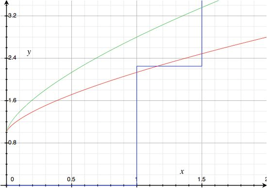

% Modelling assignment: Education Policy
% Anne van de Vorst and Bart de Geus
% Seminar Development & Growth

Introduction
============

Motivation
----------

In this modeling assignment we will introduce a subsidy to education in the model used in section 13.3.2 of Aghion and Howitt (2009).

Overview I
----------

* Aghion and Howitt describe a model that was inspired by Acemoglu (1997) and Redding (1996). 
* The model looks at the composition of education spending and the way it interacts with the level of technological development in a country. 

Overview II
---------

- Individuals make a decision regarding the amount of investment in education in period 1.
- At the same time, entrepreneurs decide how much they would like to invest in innovation.
- These decisions depend on the expected level of productivity growth and the expected level of human capital respectively.
- Thus, the decisions depend on the decision of the other party and as a result of this interaction; there are multiple growth paths; a low-growth equilibrium and a high-growth equilibrium. 
- Since it is hard to leave the low growth equilibrium this equilibrium is often called a low-development trap. 

Overview III
-----------

We will introduce subsidies on education and see what the result of this subsidy is on the equilibriums and whether this might be a solution for the low-development trap. 

First, we will give an overview of the model in section 13.3.2.

Model
======

Individuals: utility
--------------------
 
Individuals:
* live for two periods and are born with a level of human capital that is equal to one.
* maximize their utility
* discout future consumption
 
$$
  \underset{\nu}{max}\{u\}=\underset{\nu}{max}\{c_1+\rho c_2\}
$$

------

The consumption functions of the individuals are the earnings of the young in every period. These function are given by the following formulas:

$$
  c_{young,t}=(1-\nu_t)A_t
$$
$$
  c_{old,t+1}=\beta A_{t+1}h_{old,t+1}
$$

Individuals: human capital
----------

The more they will invest in education, the higher the increase in human capital is:

\begin{equation*}
  h_{2,t}=1+\gamma\nu^{\theta}
\end{equation*}
\begin{equation}
  h_{2,t}=1+\gamma\left(\left[\beta\rho\theta\gamma\left(\mu\lambda+1-\mu\right)\right]^{\frac{1}{1-\theta}}\right)^{\theta}
\end{equation}

---------

Inserting human capital in the consumption function and inserting the consumption functions in the utility function;
  maximize the utility function with respect to $\nu;
  rewriting this first order condition gives:

\begin{equation}
  \nu^{*}=\left[
    \frac{1}{\rho\beta
      \left[\mu\lambda+1-\mu\right]
    \theta\gamma}
  \right]^{\frac{1}{1-\theta}}
\end{equation}

Graphical
---------

Figure 1 shows the correlation between expected productivity growth and the level of human capital.

Numerical example
==================

Benchmark
--------

We have given our parameter the values in Table 1 to construct Figure 1. 

|Parameter	|Values		|	|Parameter	| Values	|
|:--------------|:-------------:|-------|:--------------|:-------------:|
| $\beta$	|$\frac{2}{3}$	|	| $\mu$		| 0 or 1	|
| $\gamma$	| 2		|	| $\lambda$	| 1.5  		|
| $\theta$	| 0.4		|	| $\alpha$	| 0.3		|
| $\rho$	| 0.8		|	| A		| 1		|

Parameter rationale
----------------

* According to Mankiw et al. (1992) the return to human capital is two-thirds, therefore we have set $\beta=\frac{2}{3}$;
* We believe individuals do not discount their future consumption that much and therefore we have set $\rho=0.8$;
* We have normalized this level to 1 for simplicity;
* $\theta$ was chosen to be smaller than 0.5 to ensure diminishing returns to human capital;
* Other parameters \(like $\alpha&\) were chosen to ensure the model shows multiple growth paths

Equilibrium with subsidy
-----------------------

Figure 4: Level of human capital on expected productivity growth, effect of
a subsidy

References
==========

References
---------

-  Acemoglu, Daron. 1997. ''Training and Innovation in an Imperfect Labour Market.'' _The Review of Economic Studies_ 64 (3): 445-64. doi:10.2307/2971723.
-  Aghion, Philippe, and Peter W. Howitt. 2009. _The Economics of Growth_ Cambridge, MA: The MIT Press.
-  Mankiw, N. Gregory, David Romer, and David N. Weil. 1992.''A Contribution to the Empirics of Economic Growth.'' _The Quarterly Journal of Economics_ 107 (2): 407-37. doi:10.2307/2118477.
-  Redding, Stephen. 1996. ''The Low-Skill, Low-Quality Trap: Strategic Complementaries between Human Capital and R\&D.'' _The Economic Journal_ 106 (435): 458-70. doi:10.2307/2235260.

Complete assignment
===================

The complete assignment
----------------------

Can be found on [Github](http://bartdegeus.github.io/assignment-2-html/assignment-2.html)